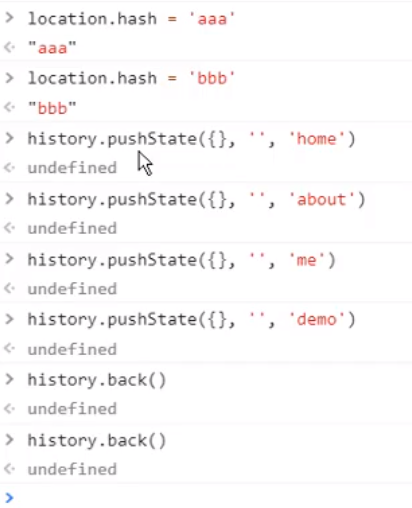
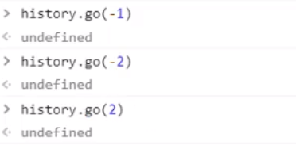
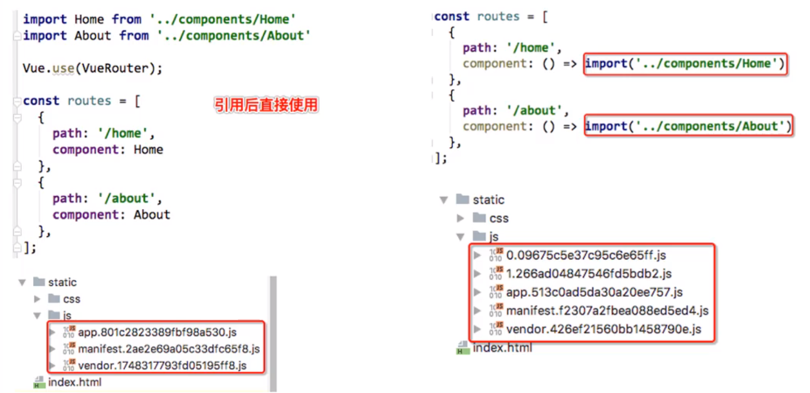
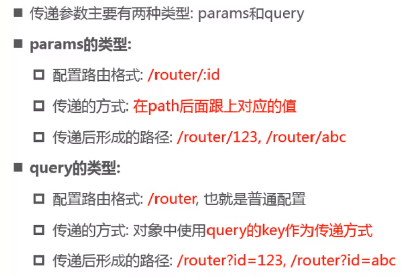

# (十七)vue-router
## 一、路由两种模式 Hash History
1、浏览器URL改变方式
- 不刷新浏览器，浏览器返回和后退可用，保存历史记录
    1. `location.hash = "aaa" `
    2. `history.pushState({}, '', 'home'') `（入栈）  &nbsp;&nbsp;先进后出
    
        `history.back()` 或者 `history.go(-1)`（出栈），其中go可以为-1、-2，1，2，表示回退或前进到第几个URL地址
    
- 不刷新浏览器，浏览器返回和后退不可用，不保存历史记录  

    `history.replaceState({}, '', 'home'') `
  
- 刷新浏览器

    `location.href = "aaa"`

2、补充说明   

   
   
3、如图所示





## 二、路由的默认路径配置


- 使用redirect重定向
- 默认是Hash模式，使用mode改变url路径，比如 `mode: 'history'`

## 三、router-link 属性配置


## 四、动态路由

path路径里面有参数（path路径不确定），称为动态路由。示例： `/user/:id`

- $router 为VueRouter的实例，想要导航到不同URL，则使用$router.push方法
- $route  为当前router跳转对象（当前谁处于活跃状态，拿到的就是当前活跃路由），可以获取name、path、params、query等
  
  - 页面接收来源url路径的的参数，`$route.params.id`
  
## 五、路由的懒加载

1、定义：

  - 把不同路由对于的组件分割成不同的代码块，然后当路由被访问的时候才加载对应的组件

2、作用：
    
   - 将路由对应的组件打包成一个个的js代码块
   - 只有在路由被访问到的时候，才加载对应的组件
   
3、使用：

  - 推荐 `const home = () => import('./components/Home')`



## 六、路由的嵌套使用   

## 七、路由的参数传递 
1、传递方式



## 八、导航守卫

例如：每个路由页面的title显示

1)、index.js页面添加元数据
```shell
  // 元数据（描述数据的数据）
  meta: {
    title: "首页"
  }
```
2)、main.js设置路由标题

```shell
  // 根据路由设置标题
  router.beforeEach((to, from, next) => {
    // 路由发生改变修改页面的title
    document.title = to.matched[0].meta.title
    next();
  })
```

1、全局守卫

- router.beforeEach 
- router.afterEach 

2、路由独享守卫

3、组件内守卫

详细参考官网：https://router.vuejs.org/zh/guide/advanced/navigation-guards.html


## 九、路由的keep-alive使用

keep-alive是Vue内置的一个组件，可以使被包含的组件保留状态，或避免重新渲染

它有两个重要属性

- include - 字符串或正则表达式，只有匹配的组件会被缓存

- exclude - 字符串或正则表达式，任何匹配的组件都不会被缓存


```shell
    // 这两个函数只有在使用keep-alive时，才是有效的
    activated() {

    },
    deactivated() {

    }
```
