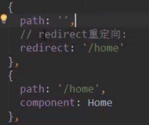

#vue-router
## 一、路由两种模式 Hash History

1、浏览器URL改变方式

- 不刷新浏览器，浏览器返回和后退可用，保存历史记录

    1. `location.hash = "aaa" `
    
    2. `history.pushState({}, '', 'home'') `（入栈）  &nbsp;&nbsp;先进后出
    
        `history.back()` 或者 `history.go(-1)`（出栈），其中go可以为-1、-2，1，2，表示回退或前进到第几个URL地址
    
- 不刷新浏览器，浏览器返回和后退不可用，不保存历史记录  

    `history.replaceState({}, '', 'home'') `
  
- 刷新浏览器

    `location.href = "aaa"`

2、补充说明   
   
   
   
3、如图所示

## 二、路由的默认路径配置

- 使用redirect重定向
- 默认是Hash模式，使用mode改变url路径，比如 `mode: 'history'`

##三、router-link 属性配置

### 四、动态路由

path路径里面有参数（path路径不确定），称为动态路由。示例： `/user/:id`

- $router    new VueRouter()的实例对象
- $route     当前谁处于活跃状态，拿到的就是当前route

